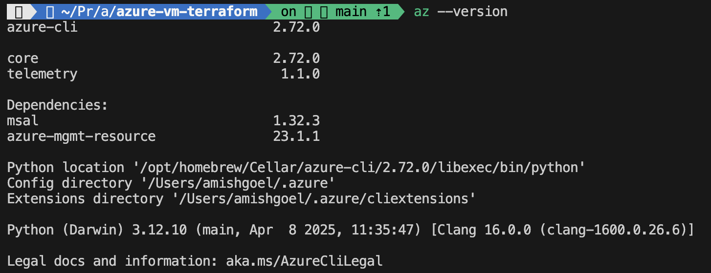
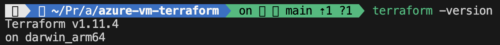
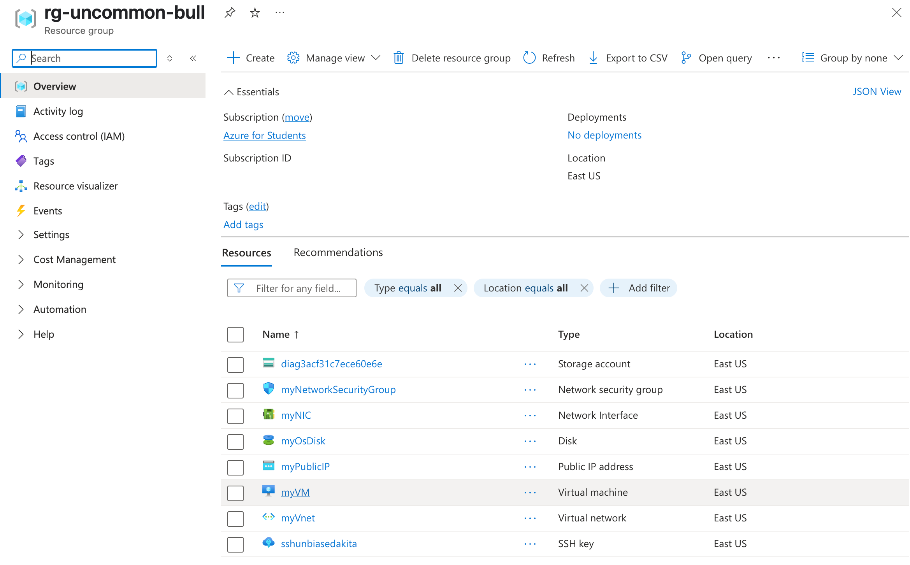

# Azure Linux VM Deployment with Terraform

This project demonstrates how to use [Terraform](https://developer.hashicorp.com/terraform) to deploy a Linux virtual machine (VM) in Microsoft Azure. It includes configuration steps for setting up the environment, provisioning the infrastructure, and connecting via SSH.

---

## 🔧 Prerequisites

- Azure CLI  
- Terraform CLI  
- An active Azure subscription  
- GitHub SSH key configured (optional but recommended)

---

## 🧩 SSH Configuration for GitHub

Before cloning a private repo using SSH:

```
cat ~/.ssh/config
```

Add GitHub block to SSH config:

```
Host github.com
  AddKeysToAgent yes
  UseKeychain yes
  IdentityFile ~/.ssh/id_ed25519
```

[GitHub SSH Setup](https://docs.github.com/en/authentication/connecting-to-github-with-ssh/generating-a-new-ssh-key-and-adding-it-to-the-ssh-agent)

✅ Switched to using SSH after HTTPS cloning failed.  
🛑 To roll back: remove the GitHub block from `~/.ssh/config`.

---

## 🚀 Terraform Setup Steps

### 1. Install Azure CLI

```
brew update && brew install azure-cli
```

Check version:

```
az --version
```

Uninstall:

```
brew uninstall azure-cli
rm -rf ~/.azure
```

### 2. Install Terraform

```
brew tap hashicorp/tap
brew install hashicorp/tap/terraform
brew update
brew upgrade hashicorp/tap/terraform
```

Check version:

```
terraform -version
```

### 3. Authenticate to Azure

```
az login
az account list
az account show
```

[Terraform Authentication with Microsoft Account](https://learn.microsoft.com/en-us/azure/developer/terraform/authenticate-to-azure-with-microsoft-account)

---

## 📁 Terraform Project Structure

**providers.tf**

- Declares the Terraform version and Azure provider configuration.

**variables.tf**

- Global variables used across files (accessed via `var.variable_name`).

**main.tf**

- Contains the core resource blocks (e.g., `azurerm_linux_virtual_machine`).

**outputs.tf**

- Specifies output values such as public IP or SSH key.

---

## 💸 Optimizing for Free Tier

Changed VM size:

```
size = "Standard_B1s"
```

Changed disk size:

```
os_disk {
  disk_size_gb = 64
}
```

---

## ⚙️ Terraform Execution

Initialize project:

```
terraform init
```

Create execution plan:

```
terraform plan -out main.tfplan
```

Apply changes:

```
terraform apply main.tfplan
```

---

## 🔑 SSH Key Handling

Saved private key from output to `~/.ssh/keyname`

Set permissions:

```
chmod 600 keyname
```

Initially encountered "invalid format" error. Was mistakenly using public key.  
Added a ouptut block to retreive private key from azapi_resource_action resource and used the private key to connect afterward. 

---

## 🧹 Clean-up Instructions

Remove GitHub block:

```
nano ~/.ssh/config
```

Delete key if needed:

```
rm ~/.ssh/keyname
```

---

## 📚 Resources

- [Azure Terraform Quickstart](https://learn.microsoft.com/en-us/azure/virtual-machines/linux/quick-create-terraform?tabs=azure-cli)  
- [Terraform Registry - azurerm](https://registry.terraform.io/providers/hashicorp/azurerm/latest/docs)  

---

## 📸 Screenshots

> Replace with actual screenshots

**Azure CLI installed**  


**Terraform installed**  


**VM in Azure Portal**  


---

## 🏁 Conclusion

This project highlights how to securely and efficiently deploy a Linux VM to Azure using Terraform, with attention to cost optimization and automation. Future enhancements could include remote backend configuration, module abstraction, and more secure secret handling.
